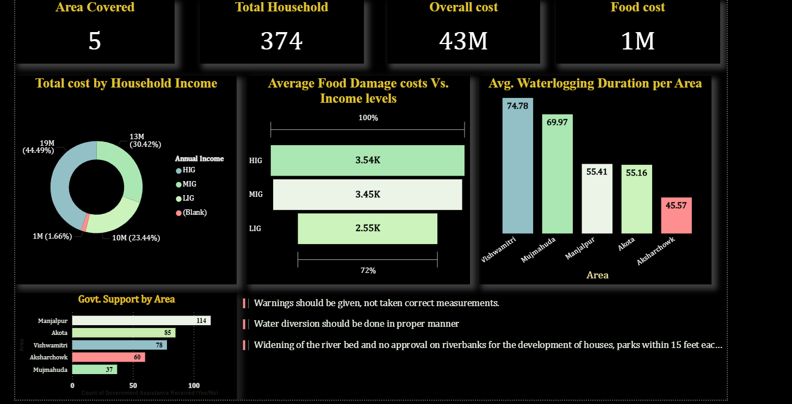

# Flood Impact & Economic Recovery Analytics Dashboard

## Overview

This project analyzes the socioeconomic impact of the 2024 Vadodara floods using survey data collected from 374 households across five affected regions.

## Tools Used

- Power BI
- Excel
- Data Analysis
- Data Visualization

## Key Findings

- Total economic loss exceeded ₹43 million.
- Lower-income households were the most affected.
- Only 9% of households received flood warnings.
- Food damage exceeded ₹1.2 million.

## Skills Demonstrated

- Dashboard Development
- KPI Design
- Data Cleaning
- Data Visualization
- Insight Generation
- Survey Analytics

## Dashboard Screenshots

### Overview

### Food Cost Analysis

### Flood Factors Analysis

### Insights

